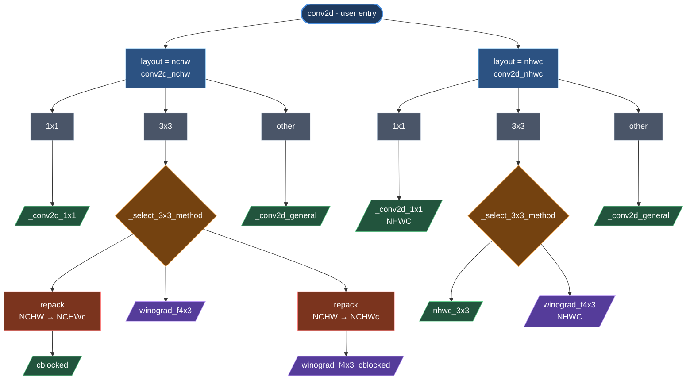

# Design

This document explains how `aiter.ops.triton.conv` is structured, what each kernel does
and why, the math behind the Winograd path, the heuristic that picks between
methods, the memory layouts and repacking that connect them, the numerical
tolerance model used by the test suite, and how to add a new kernel.

> **Audience.** Anyone planning to extend the library, debug a performance
> regression, or evaluate whether to take a dependency on it.

---

## 1. Goals and non-goals

**In scope.**

- Forward 2-D convolution on AMD ROCm/RDNA (WMMA-capable).
- `fp16` and `bf16` inputs; configurable output dtype.
- NCHW and NHWC input layouts.
- Optional fused bias add and activation (`relu`, `relu6`, `gelu`).
- Drop-in replacement for `nn.Conv2d` for inference.

**Out of scope (today).**

- **Backward / training.** Inference only. No grad support.
- **`groups > 1`** (depthwise / grouped). Detected at the example layer and
  left to PyTorch/MIOpen.
- **`padding_mode != "zeros"`** (reflect / replicate / circular). Same fall-back.
- **fp32 / fp8 inputs not supported.**

---

## 2. Architecture at a glance



The Winograd kernels (`winograd_f4x3*`) themselves are a 3-stage pipeline:


### Layered Python modules

```
aiter/ops/triton/conv/
  __init__.py          empty marker (consumers import directly from conv2d.py)
  conv2d.py            public functions + smart routing in conv2d_nchw / conv2d_nhwc
  _launch.py           grid setup, _select_3x3_method, dtype mapping
  _prepack.py          weight/input repacks + LRU caches
  _utils.py            shape math, _is_*_conv predicates, eligibility checks

aiter/ops/triton/_triton_kernels/conv/
  __init__.py          empty marker (kernels are imported by full path)
  helpers.py           CONV_AUTOTUNE_ENABLED env-var gate (consumed when
                       AITER_TRITON_CONV_AUTOTUNE=1). Activation helpers
                       (_relu, _relu6, _gelu_tanh) are imported from the
                       shared aiter/ops/triton/_triton_kernels/activation.py.
                       Each kernel file ships its own AUTOTUNE_*_CONFIGS
                       candidate-config list alongside the kernel it tunes.
                       Steady-state per-kernel configs live in JSON under
                       aiter/ops/triton/configs/conv/, loaded via
                       aiter/ops/triton/utils/conv_config_utils.py.
  conv_1x1.py          1×1 GEMM kernel (NCHW + NHWC via LAYOUT constexpr)
  conv_3x3.py          3×3 NHWC kernel + 3×3 cblocked (NCHWc) kernel
  conv_general.py      K-major reduction with on-the-fly (c, r, s) decoding
  conv_3x3_winograd_f4x3.py
                       4 kernels: input transform (NCHW & NHWC), cblocked input
                       transform, batched GEMM, output transform
```

The split mirrors *responsibility*, not LOC: `conv2d.py` is "what does the user
ask for", `_launch.py` is "how do we set up the grid", `_prepack.py` is "what
shape does the kernel actually want to read", and the `_triton_kernels/conv/` folder is
"the math". `_utils.py` sits underneath all four as a shared helper layer
(shape math, eligibility predicates, output allocation, bias prep).

---

## 3. Public API

The headline is **`conv2d`**:

```python
def conv2d(x, w_oihw, bias=None, stride=(1,1), padding=(0,0), dilation=(1,1),
           activation="none", layout="nchw"):
```

| Argument | Meaning |
|---|---|
| `x` | Input. NCHW shape, optionally with `channels_last` strides for NHWC mode. |
| `w_oihw` | Weight in PyTorch's canonical `[K_out, C, R, S]` layout. |
| `bias` | Optional 1-D bias of length `K_out`, cast to fp32 once at entry. |
| `stride`, `padding`, `dilation` | Standard `Conv2d` semantics; tuples of ints. |
| `activation` | `"none" / "relu" / "relu6" / "gelu"` — fused into the kernel epilogue. |
| `layout` | `"nchw"` or `"nhwc"` (case-insensitive — passed through `.lower()`). Selects which top-level routing function runs. |

The semi-public method-specific functions (`conv2d_nchw_cblocked`,
`conv2d_winograd_f4x3_cblocked`, …) take an internal `block_k=64` channel-pack
tile size used by the prepack caches. It is intentionally not surfaced on the
public `conv2d` — every shipped config in `configs/conv/` assumes 64, so the
parameter has no good user story.

`x.dtype` is validated at entry: anything other than `torch.float16` /
`torch.bfloat16` raises `ValueError`. The output always matches the input
dtype (mirrors `nn.Conv2d`); the fp32 accumulator is downcast at store.
`w_oihw.dtype` is trusted to the kernel.

Everything else (`conv2d_nchw`, `conv2d_1x1`, `conv2d_winograd_f4x3_cblocked`,
…) is **semi-public**: not in `__all__` but importable by name. The benchmark
harness uses these directly to compare methods on the same shape.

`conv2d.py` exposes `_resolve_route(...)` — the single source of truth for
dispatch (returns a `Route` enum member whose value is the kernel display name).
The benchmark defines a thin `which_kernel(x, w_oihw, ...)` helper on top of it
to label rows in the per-layer table and pick correctness tolerances, without
launching. Routing logic stays in `conv2d.py`; the bench-only label query lives
with the bench.

---

## 4. Smart routing (`_select_3x3_method`)

Only 3×3 has a real choice — 1×1 always uses the 1×1 kernel, 5×5/7×7 always
fall to `general`. For 3×3, `_launch.py:_select_3x3_method` decides:

```python
def _select_3x3_method(N, C, H, W, K_out, stride, dilation):
    # 1) Non-Winograd-eligible (stride>1, dilation>1, or C<4) -> cblocked
    if not _is_winograd_eligible(3, 3, stride, dilation, C):
        return "cblocked"
    # 2) Tile count: F(4,3) emits one 4x4 output tile from each 6x6 input patch,
    #    overlap = 2 (input tiles step by 4 with 6-wide windows).
    P, Q = _out_hw(H, W, 3, 3, stride, (1,1), dilation)
    tile_H, tile_W = (P + 3) // 4, (Q + 3) // 4
    T = N * tile_H * tile_W
    # 3) Winograd only wins when both C and K are large enough
    #    AND there are enough tiles to amortize transform overhead.
    if C >= 512 and K_out >= 512 and T >= 98:
        return "winograd_f4x3_cblocked" if T >= 392 else "winograd_f4x3"
    return "cblocked"
```

The thresholds (`C/K ≥ 512`, `T ≥ 98`, `T ≥ 392`) come from a sweep on
RDNA4 — see the comment block in `_launch.py`. Two implications worth knowing:

1. **The router uses padding `(1,1)` regardless of the caller's padding.** The
   tile count it computes is approximate by design: the router only needs to
   pick a method, not the exact `(P, Q)`. The actual padding flows through the
   chosen kernel unchanged. (This is intentional — see
   `memory/project_select_3x3_padding_heuristic.md`.)
2. **Below `C/K = 512`, the cblocked direct kernel is faster than Winograd.**
   The Winograd transform overhead (read 6×6 patches, two 6×6 matrix
   multiplies by Bᵀ and B, ~70 fp32 FMAs per (tile, channel) for the input
   transform alone) dominates the FMA savings until the GEMM body is large
   enough.

Stride > 1 or dilation > 1 disqualifies Winograd entirely — the F(4,3)
algorithm is built around a 6-wide window stepping by 4, and that geometry
breaks under non-unit stride.

NHWC reuses the same router but collapses its output to two destinations:
the standard NHWC 3×3 kernel, or the **non-cblocked** Winograd path with its
input transform kernel switched to NHWC reading via the `LAYOUT=1` constexpr.
Even when the router returns `winograd_f4x3_cblocked`, NHWC mode falls back to
plain `conv2d_winograd_f4x3` because there is no NHWC cblocked input repack —
cblocked is an NCHW-only optimization. The GEMM and output transform are
layout-independent because they operate on `V[36, T, C_pad]` and emit directly
into the user's chosen output layout.

---

## 5. Per-kernel deep-dive

### 5.0 A platform note on `num_stages`

Every shipped config in `configs/conv/` pins **`num_stages=1`**. That is
deliberate.

The `num_stages > 1` Triton knob is meant to lower to a software-pipelined
loop: the compiler hoists global → LDS loads for iteration *i+1* across the
matmul of iteration *i* and rotates through `num_stages` LDS buffers so
memory and compute overlap. On RDNA there is no asynchronous global-to-LDS
copy instruction for the compiler to schedule ahead — global loads are
issued and waited on in-order through `s_waitcnt`. Triton's RDNA backend
therefore does not currently produce a pipelined loop for `num_stages > 1`;
the extra LDS buffers are allocated but the load hoisting never
materializes. Empirically `num_stages > 1` on RDNA either matches or loses
to `num_stages=1` (more LDS pressure, no overlap gained), so we don't sweep
it.

This is why every tile choice in the sections below is paired with
`num_warps` only — there is no stage axis to tune. Memory-latency hiding on
RDNA comes from the hardware: wave-level scheduling across CUs and
interleaving arithmetic between a load's issue and its `s_waitcnt`, rather
than from compiler-issued software pipelining.

### 5.1 `_conv2d_1x1_kernel`

A 1×1 conv is mathematically a GEMM:

```
y[n,k,p,q] = Σ_c  x[n,c,p,q] · w[k,c]      (stride/padding still apply to (p,q))
```

The kernel fuses this with the index unwrap `m → (n, p, q)` and a
`LAYOUT` constexpr (0 = NCHW, 1 = NHWC) that selects the strides on read/write.
Highlights:

- **Tile shape:** `BLOCK_M × BLOCK_N × BLOCK_K`, set per-arch in
  `aiter/ops/triton/configs/conv/{arch}-CONV-1X1.json` and loaded at launch
  via `get_conv_config("CONV-1X1")`. `num_stages=1` always — see 5.0.
- **L2 cache swizzle.** Tiles are reordered into super-groups of
  `GROUP_SIZE_M` along the `M` axis so each weight (`N`-axis) tile is reused
  across `GROUP_SIZE_M` consecutive workgroups before moving on — the same
  weight columns stay hot in L2 for the duration of a group. Standard MM
  trick.
- **Stride > 1 / non-zero padding** are handled by mapping the tile's
  `(p, q)` back to `(h, w) = (sh·p − ph, sw·q − pw)` and checking bounds. The
  hot path (stride 1, padding 0) and the slow path go through the same code
  but the mask collapses to "true" for the hot path so the compiler should
  hoist it.

### 5.2 `_conv2d_3x3_nhwc_kernel`

NHWC-native 3×3 with **K-major weight layout** `W3[K_out, 9, C_pad]`:

- For each `(p, q)` output column the kernel walks the 9 spatial taps, loads
  the corresponding `[BLOCK_M, BLOCK_K]` slice of input and the matching
  `[BLOCK_K, BLOCK_N]` slice of W3, and accumulates
  `tl.dot(...)` into `[BLOCK_M, BLOCK_N]`.
- Channel padding `C_pad` is rounded up to a multiple of `BLOCK_K` and the
  trailing weight lanes are pre-zeroed in the prepack. The spatial validity
  mask is hoisted out of the inner C loop; the only per-iteration mask is
  the channel-bound check (`k_offs < C`).
- Hardcoded `stride_x_c=1` (channels are contiguous in NHWC) means the
  load addressing collapses to a single base + linear stride; the compiler
  emits one vectorized load per row.
- **Same L2 swizzle as 5.1**: workgroups are reordered into super-groups of
  `GROUP_SIZE_M` along the `M` axis (set to 4 or 8 in
  `configs/conv/{arch}-CONV-3X3-NHWC.json`) so each weight (`N`-axis) tile
  stays hot in L2 across `GROUP_SIZE_M` consecutive workgroups.

### 5.3 `_conv2d_3x3_cblocked_kernel`

Same 3×3 math and same `M = N·P·Q` GEMM decomposition as the NHWC kernel,
but with **NCHWc input layout** `X[N, C_blocks, H, W_in, Cb]` (`Cb=64` by
default; the kernel takes it as a constexpr). Why two kernels?

- The NHWC kernel keeps the user's input layout intact (no input repack)
  and gets coalesced channel loads "for free" because channels are already
  the inner contiguous axis.
- The user's NCHW input has channels on the *outer* stride (`H·W` apart),
  so a direct read from NCHW would scatter the channel loads. cblocked
  **repacks the input once** into `[N, C_blocks, H, W, Cb]` to restore a
  small inner contiguous channel axis (`Cb` wide) that the same `M = N·P·Q`
  GEMM walk can read coalesced. Output is plain NCHW so there's no output
  repack.

Both kernels share the GEMM order; the difference is purely in the input
addressing.

Highlights:

- **`stride_x_cb=1` is hardcoded** in the load path (`k_local[None, :]`
  is added directly to the pointer without a stride multiplier), so the
  compiler emits one vectorized load per channel chunk — structurally the
  same hardcoded-stride trick as `stride_x_c=1` in the NHWC kernel.
- **Channel addressing.** Inside the C loop, `k_offs // Cb` selects the
  block index and `k_offs % Cb` the offset within the block. This stays
  coalesced **only when `BLOCK_K ≤ Cb`** — at the boundary, `cblock_idx`
  jumps and the load address discontinues. This is an implicit constraint
  on `configs/conv/{arch}-CONV-3X3-CBLOCKED.json`; new configs must respect it.
- **Same L2 swizzle as 5.1/5.2** — workgroups are reordered into
  super-groups of `GROUP_SIZE_M` along the `M` axis so each weight
  (`N`-axis) tile stays hot in L2 across `GROUP_SIZE_M` consecutive
  workgroups.

The cblocked kernel is the default for NCHW 3×3 below the Winograd threshold
because, even after paying the input repack cost, it consistently beats both
"general with K-major" and the NHWC kernel with implicit transposes. The
kernel+repack number in the bench includes the per-batch input repack;
the user-facing `conv2d_nchw` calls `get_or_make_input_pack_cblocked`, which
caches by `(storage_ptr, shape, dtype, ...)` so back-to-back calls with the
same input tensor only repack once.

### 5.4 `_conv2d_general_kernel`

The fallback for everything that isn't 1×1, 3×3, or Winograd-eligible —
i.e. any kernel size other than 1×1 or 3×3 (5×5, 7×7, dilated 5×5, etc.).
Note: dilated 3×3 still routes to cblocked, not here. Strategy:

- Pack weights once into K-major `W_K[K_out, K_pad]` where
  `K_pad = pad(C·R·S, block_k)`. The trailing `K_pad − C·R·S` weight lanes
  are zero so any reduction step in the tail contributes 0.
- Tile the output as a GEMM over `M = N·P·Q` rows × `N = K_out` cols ×
  `K = K_pad` reduction.
- **No im2col buffer.** The kernel walks `K_pad` and decodes
  `k → (c, r, s)` on the fly: `c = k // (R·S)`, `rs = k mod (R·S)`,
  `r = rs // S`, `s = rs mod S`. Each `(c, r, s)` triple yields the input
  coordinate `(h, w) = (sh·p − ph + dh·r, sw·q − pw + dw·s)` and a bounds
  mask `(oh, ow) ∈ [0,H)×[0,W)` **plus a `c < C` channel-bound check**
  (the K_pad tail decodes `c ≥ C`, so the input-side mask prevents OOB
  reads — the zero-padded weight side just guarantees those phantom
  contributions are 0). fp32 accumulator, downcast at store.
- **`LAYOUT` constexpr** (0=NCHW, 1=NHWC) selects input/output strides; the
  same kernel serves both layouts. The router calls it with `layout="nhwc"`
  for non-1×1/3×3 NHWC shapes.
- **Same L2 swizzle** as 5.1/5.2/5.3 — `GROUP_SIZE_M` super-grouping along M.

### 5.5 The Winograd path — four kernels

Winograd F(4×4, 3×3) reduces the **144** multiplies per 4×4 output tile of
a direct 3×3 (16 outputs × 9 taps) to 36 multiplies *total* (one batched
36-way GEMM) — **4× fewer multiplies** in the inner GEMM, modulo
floating-point ordering. We pay for it in: (a) input/output transforms
that touch every element with small constants, (b) increased numerical
sensitivity in fp16/bf16. The math is in section 6; here are the four kernels:

| Kernel | What it does | Output shape |
|---|---|---|
| `_winograd_f4x3_input_transform_kernel` | One 6×6 patch per `(t, channel-tile)`, computes `BᵀXB` in fp32, stores to V | `V[36, T, C_pad]` |
| `_winograd_f4x3_cblocked_input_transform_kernel` | Same, but reads from NCHWc `[N, C_blocks, H, W, Cb]` for coalesced loads | `V[36, T, C_pad]` |
| `_winograd_f4x3_batched_gemm_kernel` | 36 independent GEMMs `T × C_pad × K_out`, output `M[36, T, K_out]` | `M[36, T, K_out]` |
| `_winograd_f4x3_output_transform_kernel` | One 6×6 `M` slice per `(t, k)`, computes `AᵀMA` (4×4), bias + activation, scatter to NCHW or NHWC output | `Y[N, K_out, P, Q]` |

`conv2d_winograd_f4x3` and `conv2d_winograd_f4x3_cblocked` both use the
3-kernel pipeline (input transform + GEMM + output transform).

The **filter transform** `U = G g Gᵀ` runs once on the host in
`prepack_winograd_filter_f4x3` (in fp32), then is cast to the activation
dtype and stored as `U[36, K_out, C_pad]`. The transform is per-weight, not
per-call, so it amortizes across every forward pass.

---

## 6. Winograd F(4×4, 3×3) — full derivation

Notation: `g` = 3×3 filter, `d` = 6×6 input tile, `Y` = 4×4 output tile.

### 6.1 Why Winograd

A direct 3×3 conv produces 4 output values from 6 input values along one
axis using `4 × 3 = 12` multiplies. Winograd's minimal 1-D algorithm
F(4, 3) needs only **6** multiplies for the same 4 outputs. Tensoring along
both spatial dims gives F(4×4, 3×3): `4×4 = 16` outputs from a 6×6 input,
in `6×6 = 36` element-wise products instead of `16 × 9 = 144`.

Per output element: 144 / 16 = 9 muls direct, 36 / 16 = 2.25 muls Winograd
→ **4× fewer multiplies** in the inner tensor product. The headline 4×
ignores the input/output transforms (`BᵀdB`, `AᵀMA`), which aren't free
and are why the realized speedup is smaller than 4×.

**Reporting convention.** Both the bench harness and the published charts
divide measured wall time by the *direct-convolution* FLOP count
`2·N·K·C·R·S·H·W`, regardless of which algorithm actually ran. This is
the universal convention — it gives a single yardstick on which different
algorithms (direct, im2col-GEMM, Winograd, FFT) are comparable, since
literal hardware-MAC counts are not. The implication: a Winograd row's
TFLOPS overstates the literal MACs/sec the hardware executes by ~4× for
F(4×4, 3×3) and ~2.25× for F(2×2, 3×3). MIOpen's Winograd solvers
(`ConvBinWinogradRxSf3x2`, `ConvWinoFuryRxS<2-3>`) are reported the same
way, so Triton-vs-MIOpen comparisons remain apples-to-apples.

### 6.2 The transform matrices

For F(4, 3) the standard Cook-Toom matrices (with
`{0, ±1, ±2, ±½, ∞}` interpolation points) are:

```
       ┌  6   0   0 ┐                ┌  4   0  -5   0   1   0 ┐
       │ -4  -4  -4 │                │  0  -4  -4   1   1   0 │
G  =   │ -4   4  -4 │ × (1/24)   Bᵀ =│  0   4  -4  -1   1   0 │
       │  1   2   4 │                │  0  -2  -1   2   1   0 │
       │  1  -2   4 │                │  0   2  -1  -2   1   0 │
       └  0   0   24┘                └  0   4   0  -5   0   1 │   (×1, no scale)

         ┌ 1  1  1   1   1   0 ┐
   Aᵀ  = │ 0  1 -1   2  -2   0 │
         │ 0  1  1   4   4   0 │
         └ 0  1 -1   8  -8   1 ┘     (4×6, scale 1)
```

(`_prepack.py:prepack_winograd_filter_f4x3` writes G with the `1/24` already
absorbed: rows scaled by `1/4, -1/6, -1/6, 1/24, 1/24, 1` so a host-side
`G g Gᵀ` produces `U` directly.)

The math is then:

```
  U   = G g Gᵀ          (6×6, computed once per weight, host-side, fp32)
  V   = Bᵀ d B          (6×6, computed per input tile, on-chip, fp32)
  M   = U ⊙ V           (6×6, element-wise)
  Y   = Aᵀ M A          (4×4, output tile)
```

**Batched.** With `T = N · ⌈P/4⌉ · ⌈Q/4⌉` tiles and `C` channels per tile,
the per-tile element-wise product becomes a tile-batched GEMM:

```
  M[α, t, k] = Σ_c  U[α, k, c] · V[α, t, c]      α ∈ [0, 36)
```

— **36 independent GEMMs** of shape `(T, C) × (C, K_out)`. This is what the
batched GEMM kernel does: `tl.program_id(1)` selects one of the 36 `α`
slices and `tl.program_id(0)` selects a `(t, k)` tile (with the standard
`GROUP_SIZE_M` L2 swizzle), then runs a normal Triton MM over `c`.

### 6.3 What the kernels actually look like

The transform matrices are **embedded in the JIT'd kernel as Python
constants** (not loaded from memory), so the compiler can constant-fold and
strength-reduce. The input transform `V = Bᵀ d B` is computed as the
standard two-pass factorization — column transform first (`t = Bᵀ d`),
then row transform (`V = t B`):

```
  # column transform  (t = Bᵀ d), 36 values, each 4–6 fp32 ops
  t00 = 4*d00 - 5*d20 + d40
  t01 = 4*d01 - 5*d21 + d41
  ...
  # row transform  (V = t B), 36 values, each 4–6 fp32 ops
  v00 = 4*t00 - 5*t02 + t04
  v01 = -4*t01 - 4*t02 + t03 + t04
  ...
```

Each row of `t` is reused across all 6 columns of `V` in that row, so the
two-pass form is ~72 small fp32 expressions total (36 `t` + 36 `v`) versus
the much larger sum-of-products that a fully-expanded `Bᵀ d B` would
unroll to. Input is loaded once per `(t, channel-tile)` as a 6×6 spatial
block over `BLOCK_C` channels, cast to fp32, transformed, stored to
`V[36, T, C_pad]`.

The output transform is symmetric: read `M[36, t, k]` (6×6 per tile),
compute `AᵀMA` (4×4), add bias, apply activation, scatter to `Y` (NCHW or
NHWC, picked via a `LAYOUT` constexpr). The scatter has to write 16 values
per tile to a strided output; this is where the kernel does the most index
arithmetic.

### 6.4 Numerical caveat

The output transform `AᵀMA` has elements as large as `±8`. Rounding errors
in `M` from the GEMM accumulation compound through the transform on both
sides of `AᵀMA`. Row 3 of `Aᵀ` (`[0, 1, -1, 8, -8, 1]`) has L1 norm `19`;
applied on both sides for the worst element `Y[3, 3]`, this bounds the
error amplification at `19 × 19 = 361×`. On bf16 (mantissa = 7 bits,
ε ≈ 2⁻⁷) that's enough to typically drop **3–4 bits of precision** vs the
direct conv. Two consequences:

1. The accumulators are **fp32 throughout** (Triton's `tl.dot` produces
   fp32; we keep it fp32 through the output transform and only downcast at
   store). This is non-negotiable.
2. We disable Winograd for `C < 4` in `_is_winograd_eligible`, because at
   `C=3` (RGB conv1) there aren't enough sum terms to absorb the
   amplified rounding within the test tolerance.

The test harness applies a **6× tolerance multiplier** to Winograd kernels
(`_winograd_tolerances`); see §8.

---

## 7. Memory layouts and repacking

There are four "shapes" the kernels actually consume, plus the user's NCHW
input:

| Layout | Kernel | Where the repack happens | Cached? |
|---|---|---|---|
| `[K_out, K_pad]` (K-major weight) | `general` | `_prepack.py:prepack_oihw_to_kmajor` | LRU 256, `_PACK_CACHE` |
| `[K_out, 9, C_pad]` (3×3 weight) | `3x3_nhwc`, `3x3_cblocked` | `prepack_oihw_to_3x3` | LRU 256, `_PACK_CACHE_3x3` |
| `[N, C_blocks, H, W, Cb]` (NCHWc input, `Cb=64`) | `3x3_cblocked`, `winograd_f4x3_cblocked` (input transform) | `prepack_nchw_to_cblocked` | **Single-entry dict** by design |
| `[36, K_out, C_pad]` (Winograd weight) | `winograd_f4x3_*` | `prepack_winograd_filter_f4x3` | LRU 256, `_PACK_CACHE_WINOGRAD_F4X3` |

### Why three weight caches are LRU but the input cache is single-entry

Weights are reused every forward pass. A 53-layer ResNet has 53 unique
weight tensors; with a 256-entry LRU we keep them all warm and the second
forward pass through the model has zero repack cost.

Input activations are *unique intermediate tensors* — the output of layer N
is consumed exactly once, by layer N+1, and never seen again. Caching them
LRU would just bloat memory; a single-entry dict is enough to dedup
repeated calls with the same tensor (which the bench loop *does* do — it
runs each layer with `warmup=15, rep=50` over the same input to get a
stable timing). The `.clear()` in the bench's per-call setup deliberately
models the per-batch repack cost in real inference, which is reported as
the "kernel + repack" row.

### Cache key safety

Each cache key includes `(storage_ptr, shape, dtype, block_k, _version)`.
The cache also stores a strong reference to the source tensor in the value,
so its storage cannot be freed and re-used by a different tensor while the
entry lives — this prevents `storage_ptr` collisions from producing a
false hit. The single-entry input cache also re-checks the source pointer
on hit (defense in depth).

`AITER_TRITON_CONV_PACK_CACHE_SIZE=N` (env var) overrides the LRU bound.
Default 256 is enough for the models exercised by the bench harness without
eviction; larger models need the env override.

---

## 8. Numerical model and tolerances

`_helpers.py:dynamic_conv_tolerances` is the formula used by the test
harness:

```python
eps  = {fp16: 2**-10, bf16: 2**-7, fp32: 2**-23}[dtype]
rtol = 6e-3 if K_red < 1024 else 8e-3 if K_red < 4096 else 1.2e-2
atol = max(eps * 8, 10.0 * eps * sqrt(K_red))
```

Where `K_red = C · R · S`. Two facts behind this:

1. **Multiplication of two ε-rounded inputs has relative error ε.**
2. **Summing N independent rounding errors in fp32 grows as `ε · √N`** (random
   walk), not `ε · N` (worst-case). Real kernels are not adversarial: the
   `√N` bound matches what we observe across thousands of fuzzer shapes.

The `10×` multiplier covers worst-case ordering differences between our
Triton accumulation order and PyTorch's (different tile shape → different
sum order → different rounding).

**The `rtol` step-ladder.** `rtol` widens in two steps as the reduction
depth `K_red = C · R · S` grows: `6e-3` below 1024, `8e-3` below 4096,
`1.2e-2` beyond. The reasoning is the same √N error growth as `atol` — a
deeper reduction accumulates more rounding, so the *relative* error budget
has to widen too — but discretized into buckets rather than a continuous
`√K_red` curve, because rtol is a coarse backstop to atol (which already
carries the continuous term). The three breakpoints and values are
empirical: each is the tightest rtol that still passes across the full
fuzzer shape sweep at that depth, so the ladder stays as strict as the
hardware allows without flagging healthy fp16/bf16 ordering noise. They are
not derived from a closed form — retune them if the kernel set or the
reference accumulation order changes.

`_winograd_tolerances` then bumps `rtol` by **6×** and `atol` by
`max(6×, 0.6)` for any Winograd kernel — the `0.6` floor catches
small-`K_red` cases where the √N-scaled base atol is too tight to absorb
the F(4,3) amplification. The 6× factor is empirical: the analytical
bound from §6.4 is 361× worst-case, but the *typical* amplification on
natural images is much smaller because the worst-case tile structure is
rare. 6× catches the long tail without flagging healthy fp16 ordering
noise.

If a new kernel needs the Winograd bump, mark it `is_winograd=True` in
`op_tests/triton_tests/conv/_helpers.py` (`METHOD_REGISTRY`); the
`_get_tolerances` dispatch picks the right tolerance automatically.

---

## 9. Config resolution — how JSON serves every layer

Each kernel fetches its launch parameters (tile sizes, `num_warps`, etc.) at
launch time via `get_conv_config(...)` in
`aiter/ops/triton/utils/conv_config_utils.py`, which reads the per-arch JSON in
`configs/conv/{arch}-CONV-{KERNEL}.json`. There is **no runtime autotune on the
hot path** — the search already happened offline and its winners are frozen in
JSON, so first-call latency and CI compile time stay predictable. (The
`AITER_TRITON_CONV_AUTOTUNE=1` escape hatch restores live `@triton.autotune`
for development; it is off by default and never used in normal inference.)

### The JSON is a keyed lookup, not a list of layers

A common confusion: "ResNet-50 has 53 conv layers, but the JSON only has ~23
entries — how does inference work?" The JSON is **not** a per-layer list. It is
a shape-keyed lookup table with a three-tier fallback, so it can never "miss":

```
get_conv_config walks, first hit wins:
  1. shapes[shape_key]   exact-shape pin  (the offline-tuned entries)
  2. M_LEQ_<n>           nearest row-count bucket (M_total, or T for Winograd)
  3. "any"               global fallback
```

At inference every one of the 53 physical layers fires and issues its own
kernel launch. Each builds a `shape_key`
(`format_shape_key(N,C,H,W,K,R,S,…)`) and looks it up:

- ResNet-50's 53 conv layers span only **23 distinct shapes** (repeated
  bottleneck blocks reuse shapes). The 23 distinct shapes hit **Tier 1**
  (they are exactly what was tuned into `shapes`). The ~30 duplicate layers
  build a `shape_key` identical to one of the 23, so they re-resolve to the
  same Tier-1 entry — an LRU-cached, near-free re-read. **53 launches,
  ≤23 distinct config lookups.**
- A shape that was *not* tuned offline (e.g. a different batch size, so
  `N` differs) matches nothing in Tier 1. It does not error — it falls to the
  `M_LEQ_<n>` bucket for its row count, or ultimately to `"any"`. Slightly
  less optimal, still correct.

This tiered fallback is why tuning only the **deduped** shape set is safe:
identical shapes need tuning once, and any unseen shape degrades gracefully
instead of failing. `get_conv_config` is modeled on `get_gemm_config` and uses
the same `M_LEQ_x → any` walk; the conv-native addition is the exact-shape
Tier-1 (`shapes[shape_key]`), since conv has more shape degrees of freedom than
GEMM's M/N/K.

> The dedup lives in two independent places, both offline: the **bench** shape
> list (`conv_shapes.json`, timing distinct work once) and the **tuning** set
> (`tune_conv2d.py` dedups by literal tuple before sweeping). Neither the bench
> nor the runtime lookup re-dedups; the runtime simply reuses a config when two
> layers share a shape.

---

## 10. Method registry

`op_tests/triton_tests/conv/_helpers.py` (`METHOD_REGISTRY`) is the **single source of truth**
for kernel dispatch in the test harness. Adding a new method takes one entry:

```python
METHOD_REGISTRY = {
    "default":                MethodEntry(conv2d_nchw,                   None,        False, "",                         "default"),
    "cblocked":               MethodEntry(conv2d_nchw_cblocked,          _3x3_guard,  False, "[cblocked]",               "cblocked"),
    "winograd_f4x3":          MethodEntry(conv2d_winograd_f4x3,          _wino_guard, True,  "[winograd_f4x3]",          "WF(4,3)"),
    "winograd_f4x3_cblocked": MethodEntry(conv2d_winograd_f4x3_cblocked, _wino_guard, True,  "[winograd_f4x3_cblocked]", "WF4cb"),
}
```

| Field | Purpose |
|---|---|
| `kernel_fn` | The public `conv2d_*` wrapper (not the raw kernel) — handles repack and grid setup, or routes to a specialized variant (`conv2d_nchw` does smart routing). |
| `guard_fn(R, S, stride, dilation, C)` | Returns `True` if the method is applicable. `None` means "always". |
| `is_winograd` | Selects the 6× tolerance bump in `_helpers._get_tolerances`. |
| `bench_tag` | Suffix added to the per-test result name, e.g. `"[cblocked]"`. |
| `short_name` | Reserved for future bench output; not used by `bench_conv2d.py` today. |

Wiring downstream of the registry — the parametrized pytest tests, the
tolerance dispatch — is automatic. You do not edit any of those.

---

## 11. Adding a new kernel — checklist

Concretely, to add (say) a `winograd_f6x3` variant:

1. **Implement the kernel.** New file under `aiter/ops/triton/_triton_kernels/conv/`.
   Add a `_get_config()` helper that calls `get_conv_config("CONV-<NAME>")`,
   and ship `{arch}-CONV-<NAME>.json` files under `aiter/ops/triton/configs/conv/`
   for each supported arch.
2. **Add a launch wrapper** in `_launch.py` (`_launch_winograd_f6x3`) that
   sets up the grid and turns Python ints into Triton constexprs.
3. **Add a public function** in `conv2d.py`
   (`conv2d_winograd_f6x3(...)`). Compute output shape, allocate the
   output tensor, fetch any prepacked weights from `_prepack.py`, call
   the launch wrapper. Consumers import it directly from this module —
   no `__init__.py` re-export needed.
4. **Add a prepack** in `_prepack.py` if the kernel needs a different
   weight layout. Use `_LRUPackCache` with a key that includes
   `(storage_ptr, shape, dtype, block_k, _version)` and store a strong
   ref to the source tensor in the cached value. For input-side prepacks
   (rare — only `_PACK_CACHE_CBLOCKED` does this today), use a
   single-entry plain dict cleared per-call instead — see §7.
5. **Register** in `op_tests/triton_tests/conv/_helpers.py` (`METHOD_REGISTRY`). Set
   `is_winograd=True` if the kernel uses Winograd-style transforms
   (you'll need the 6× tolerance bump). If the kernel uses a different
   Winograd tile (e.g. F(6,3)), also add a new `variant=` branch in
   `_helpers._winograd_tolerances` and route to it from
   `_helpers._get_tolerances` — F(4,3)'s 6× bump
   is calibrated specifically for that tile size. Also add the kernel to
   `op_tests/op_benchmarks/triton/bench_conv2d.py`'s `METHODS` dict so
   `--method <new_name>` works.
6. **Optionally route** from `_select_3x3_method` if the new kernel
   should be auto-selected. Update the heuristic comment block with the
   shape range where it wins. If you do route from `_select_3x3_method`,
   add a `Route` enum member (its value is the kernel display name) and a
   branch in `_resolve_route` (the single source of truth for dispatch),
   plus the matching branch in `_route_and_run`. The bench's `which_kernel`
   labels then follow automatically.
7. **Run the suite** — `pytest op_tests/triton_tests/conv/` parametrizes
   `test_no_bias` and `test_activations` over every entry in
   `METHOD_REGISTRY`, so the new method gets correctness coverage
   automatically. Bench it via
   `python -m op_tests.op_benchmarks.triton.bench_conv2d --method <new_name> ...`.

---

## 12. Known limitations and future work

- **`groups > 1`.** Kernels are `groups=1` only. Implementation entry
  points: a new `aiter/ops/triton/_triton_kernels/conv/conv_depthwise.py`
  for the depthwise case, K-major-per-group prepack in `_prepack.py`,
  route from `_select_3x3_method`.
- **`padding_mode != "zeros"`.** Reflect / replicate / circular padding
  is unsupported. Adding it is mostly a per-kernel change to the
  bounds-mask logic — replace `mask = (h ≥ 0) & (h < H) & ...` with a
  reflected/wrapped index computation.
- **Backward / training.** No gradients. Adding training would mean a
  second set of kernels (`grad_input`, `grad_weight`) and is out of
  scope for this library's intended use as an inference replacement.
